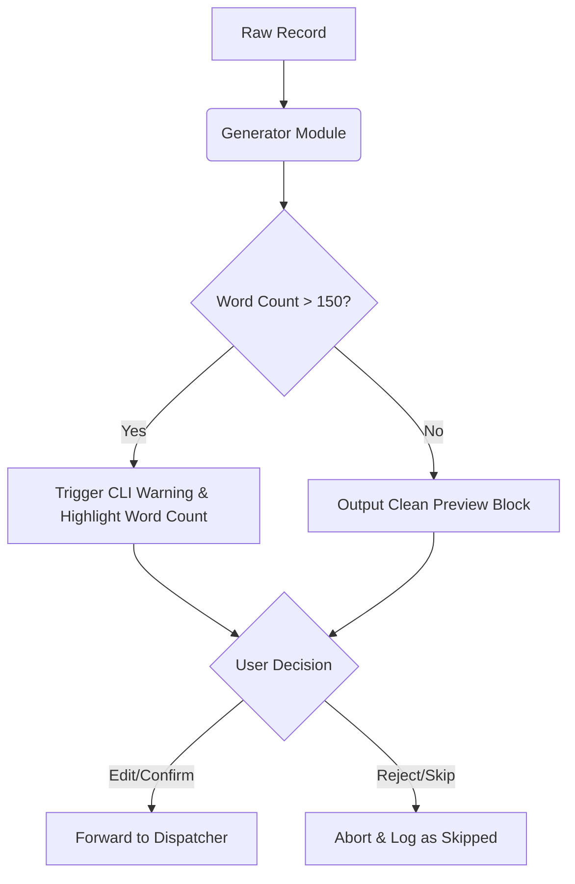

# Edge Case & Safety Specifications
## "The Closer" Cold Email Writer + Send Bot

This document outlines the failure modes, validation anomalies, security edge cases, and systemic guardrails necessary to build a production-grade and bulletproof execution environment for **"The Closer"**. 

---

## 1. Input & Parser Edge Cases

Because `contacts.json` is loaded directly into Python dictionaries, malformed inputs represent the highest risk of runtime crashes.

| Edge Case Scenario | Impact | Mitigation Strategy / Resolution | Code Logic Guideline |
| :--- | :--- | :--- | :--- |
| **Malformed JSON Syntax** | Script crashes on launch with `json.decoder.JSONDecodeError`. | Catch syntax errors and display an educational, human-readable recovery guide. | Use `try-except json.JSONDecodeError` around `json.load()`. |
| **Missing Mandatory Fields** | Missing `recipient_email` or `company` raises a `KeyError` inside generator templates. | Ingest with validation and skip malformed records, logging a warning. | Validate schema using `.get()` with default values or raise explicit, recoverable exceptions. |
| **Empty Strings / Whitespace Only** | Renders blank fields in templates (e.g., "Hi , I noticed is hiring..."). | Strip whitespace and replace empty values with general fallbacks (e.g., "Hiring Team"). | Apply `.strip()` and check `if not value: value = "Alternative"`. |
| **Duplicate Recipient Emails** | Sending multiple redundant emails to the same recruiter (looks highly unprofessional). | Maintain an in-memory `set` of processed emails to prevent duplicate dispatch. | Track and check `processed_emails` set. Skip duplicates with a logged warning. |

---

## 2. Generation & Content Edge Cases

A major risk in cold outreach is sending overly long or incorrectly formatted templates that damage conversion rates.

> [!WARNING]
> **Constraint Enforcement (Word Limit)**: Long emails are ignored. If `body.split()` exceeds **150 words**, the system must warn the user in the CLI.



### Text Formatting Anomaly Guardrails
*   **Special Characters & Emojis**: Names containing symbols (e.g., `"Möbius AI"` or `"François"`) must not crash the console stream. Establish `utf-8` file encodings globally.
*   **Missing Optional Fields**: If `portfolio_url` is absent, the sign-off block must dynamically omit the line instead of rendering `"None"`.

---

## 3. Network & Connection Failure Modes

Connecting to SMTP or third-party email APIs in a CLI context introduces multiple latency, authentication, and connection failure points.

> [!IMPORTANT]
> **SMTP Auth Failure (Gmail App Password)**
> Standard password usage with Gmail results in immediate rejection. The system must inform the user about setting up a 16-character **App Password** with 2-Factor Authentication enabled.

### Detailed Network Failure Matrix

```text
       [Connection Attempt]
               │
      ┌────────┴────────┐
      ▼                 ▼
[Authentication]     [Network/Timeout]
  - Incorrect Port     - Port 465 vs 587 Block
  - Invalid Password   - DNS lookup failures
               │
               ▼
   [Graceful Recovery Action]
   - Print clean warning to terminal
   - Log error reason inside outreach_log.csv
   - Terminate gracefully without losing logs
```

1.  **Port Blockage**: ISPs frequently block outgoing port `25` or `465`. The script should fall back to `587` with explicit `starttls()`.
2.  **Network Drop Midway**: If the internet disconnects during a batch run:
    *   Catch `socket.timeout` or `ConnectionRefusedError`.
    *   Mark current item as `failed` in the log, specifying the exact error description.
    *   Do **NOT** crash the script; give the user the option to pause, retry, or abort cleanly.

---

## 4. Local File & State Safety

To prevent logs from corrupting, the logger must handle transactional locking errors gracefully.

*   **CSV Locked by Excel**: On Windows, if a student opens `outreach_log.csv` in Microsoft Excel, the system will raise `PermissionError` when trying to append logs.
    *   *Mitigation*: Wrap the logging code in a try-except block. If blocked, notify the user `Please close outreach_log.csv in other programs and press enter to try again`.
*   **Directory Permissions**: The system must ensure target directories (like `docs/` or `.`) are writable, auto-creating them where necessary.

---

## 5. Safety, Anti-Spam & Ethical Limits

To guarantee that "The Closer" remains a tool for highly personalized, low-volume, high-quality human outreach, the following logic constraints are hardcoded into the architecture:

> [!CAUTION]
> **Spam Prevention Guardrails**:
> 1. **Batch Size Cap**: The orchestrator must reject loading batches of more than **10 records** at a time. This structurally prevents the app from being repurposed as a mass spam tool.
> 2. **Enforced Inter-Email Delay**: Implement an explicit random delay between `1.5` and `5.0` seconds after sending each email to avoid trigger-happy SMTP servers and maintain natural execution rates.
> 3. **Manual Opt-Out File**: Implement a mechanism to check a local `opt_out_list.txt`. If a recipient's email is present, the app must skip processing immediately with the status `"skipped_opt_out"`.
