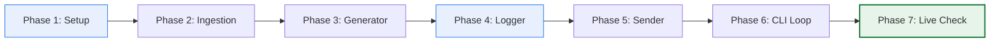

# Evaluation Framework: "The Closer"
## Stage-by-Stage Verification & Grading Rubric

This framework provides an exhaustive evaluation protocol to assess, verify, and grade the code constructed in each phase of **"The Closer"** Cold Email Writer + Send Bot. Use this guide to programmatically or manually evaluate your AI coding companion or student submissions.

---

## Evaluation Workflow Overview



---

## 1. Phase-Wise Evaluation Criteria

### Phase 1: Environment & Configuration Setup
*   **Assessment Target**: Ensure the system has a clean dependency sheet, structured configs, and zero credential safety exposures.
*   **Verification Steps**:
    1. Verify that `requirements.txt` exists and contains at least `python-dotenv`.
    2. Confirm `.gitignore` has an entry for `.env`.
    3. Validate `.env.example` contains the correct SMTP/Credentials template with `DRY_RUN=true`.
*   **Expected File Mapping**:
    *   `requirements.txt`
    *   `.env.example`
    *   `.gitignore`
*   **Grading Check**:
    - [ ] PASS: `.env` is properly ignored in Git history.
    - [ ] PASS: `.env.example` exists and maps credentials without exposing secret keys.

---

### Phase 2: Mock Ingestion Source
*   **Assessment Target**: Structural parsing of the `contacts.json` or `jobs.csv` database.
*   **Verification Steps**:
    1. Check for the existence of `contacts.json`.
    2. Ensure that it contains a valid JSON array of objects.
    3. Assert the presence of required fields: `recipient_email`, `company`, `role`, `candidate_name`, `candidate_background`.
*   **Ingestion Testing Code**:
    ```bash
    python -c "import json; data=json.load(open('contacts.json')); assert len(data) >= 3, 'Must have at least 3 mock records'"
    ```
*   **Grading Check**:
    - [ ] PASS: JSON parses successfully with zero schema syntax errors.
    - [ ] PASS: Contains at least 3 distinct outreach targets.

---

### Phase 3: Generation & Formatting Engine (`email_generator.py`)
*   **Assessment Target**: Template string interpolation correctness and word constraint validation.
*   **Verification Steps**:
    1. Import the module in Python and pass a mock dictionary target.
    2. Assert the presence of `'subject'` and `'body'` in the returned output.
    3. Inject a long template body exceeding 150 words and assert that a warning notification triggers in console output.
*   **Verification Sandbox**:
    ```python
    from email_generator import generate_email
    test_contact = {
        "recipient_name": "Test", "recipient_email": "test@test.com",
        "company": "TestOrg", "role": "Intern", "personalization_note": "A note",
        "candidate_name": "Developer", "candidate_background": "Python", "portfolio_url": "github"
    }
    email = generate_email(test_contact)
    assert "TestOrg" in email['body'], "Company details failed to interpolate."
    assert "Intern" in email['subject'], "Role details failed to interpolate."
    ```
*   **Grading Check**:
    - [ ] PASS: String formatting renders all placeholders cleanly without literal brace output.
    - [ ] PASS: Word constraints warning fires seamlessly at $> 150$ words.

---

### Phase 4: Transactional Audit Logger (`logger.py`)
*   **Assessment Target**: Sequential appending of tracking records to `outreach_log.csv`.
*   **Verification Steps**:
    1. Call the log writer module with mock values.
    2. Open `outreach_log.csv` and verify the columns parse correctly.
    3. Ensure headers are created on the first write if the file does not exist, and appended cleanly on subsequent runs.
*   **Telemetry Verification Check**:
    ```bash
    python -c "import csv; rows=list(csv.reader(open('outreach_log.csv'))); print('Logs registered:', len(rows)-1)"
    ```
*   **Grading Check**:
    - [ ] PASS: Creates the log file automatically if it is missing.
    - [ ] PASS: Telemetry tracks columns exactly: `timestamp`, `recipient_email`, `company`, `role`, `subject`, `status`, `error_message`.

---

### Phase 5: Dispatcher Client (`email_sender.py`)
*   **Assessment Target**: Verifying the dual-routing logic: Dry Run vs. Live SMTP.
*   **Verification Steps**:
    1. Trigger `send_email` while `.env` configuration has `DRY_RUN=true`.
    2. Assert that **zero network traffic** leaves the machine and the output status is returned as `"dry_run_drafted"`.
    3. Switch `DRY_RUN=false` and verify correct SMTP routing, catching authentication or network timeouts gracefully.
*   **Grading Check**:
    - [ ] PASS: Under dry-run, no internet connections are attempted.
    - [ ] PASS: Catch authentication anomalies gracefully without throwing raw stack traces to the user.

---

### Phase 6: Orchestrator Loop (`main.py`)
*   **Assessment Target**: High-impact terminal human review mechanism and system coordination.
*   **Verification Steps**:
    1. Run `python main.py` in the console.
    2. Validate that the CLI prints a clean, beautifully-spaced console card showing the preview.
    3. Input `s` (Skip) and ensure the script progresses to the next target and logs the skip event.
    4. Input `y` (Confirm) and verify it writes a success entry to logs.
*   **Grading Check**:
    - [ ] PASS: Prompt stops execution for user feedback (HITL is active).
    - [ ] PASS: Skipping a record logs a `"skipped"` entry and does not attempt any send sequence.

---

### Phase 7: Integration & Validation (Badge Review)
*   **Assessment Target**: End-to-end trace verification for student credentialing.
*   **Verification Steps**:
    1. Verify that `outreach_log.csv` exists and contains at least 3 completed entries.
    2. Verify SMTP connection delivery by reviewing a self-test email in your private inbox folder.
*   **Grading Check**:
    - [ ] PASS: Log file holds full proof of runs.
    - [ ] PASS: Outgoing delivery format is clean and free of exaggerated text.

---

## 2. Quantitative Evaluation Rubric

This grading rubric maps student projects to specific score allocations:

| Category | Points | Criteria for Full Marks |
| :--- | :---: | :--- |
| **System Security** | 20 pts | `.env` and `.gitignore` configured correctly. Real secrets are never committed in git histories. |
| **Human-in-the-loop (HITL)** | 20 pts | Terminal prompt blocks execution and honors skips (`s`), aborts (`n`), and sends (`y`). |
| **Module Autonomy** | 20 pts | Code is strictly modular (separate file inputs, templates, send mechanisms, and log engines). |
| **Edge-Case Resilience** | 20 pts | Gracefully handles Excel-locked CSV files, missing JSON schemas, and incorrect passwords. |
| **Audit Trails** | 20 pts | The `outreach_log.csv` matches the required structure and contains authentic run timestamps. |
| **Total** | **100 pts** | **Minimum Passing Target: 80 points.** |
